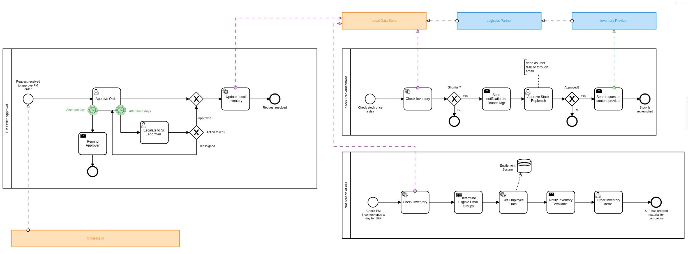
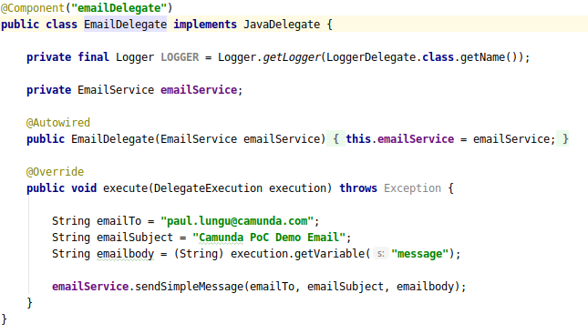
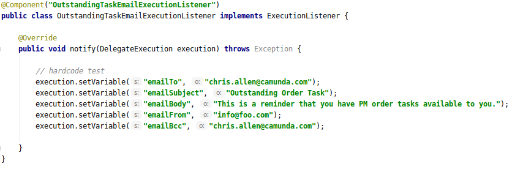
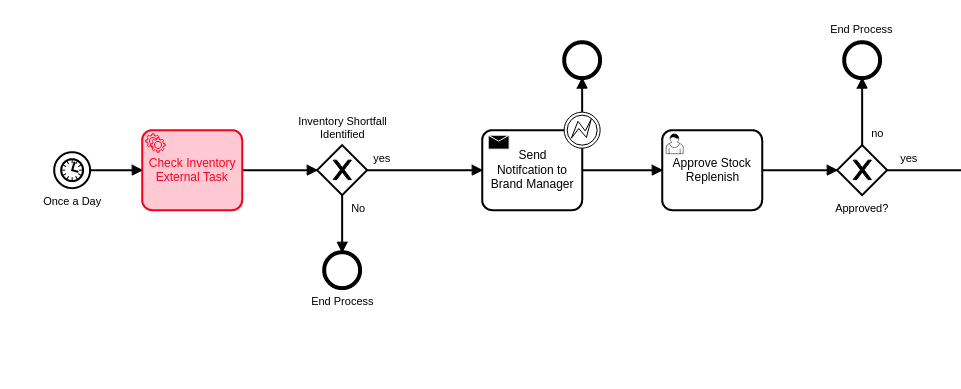
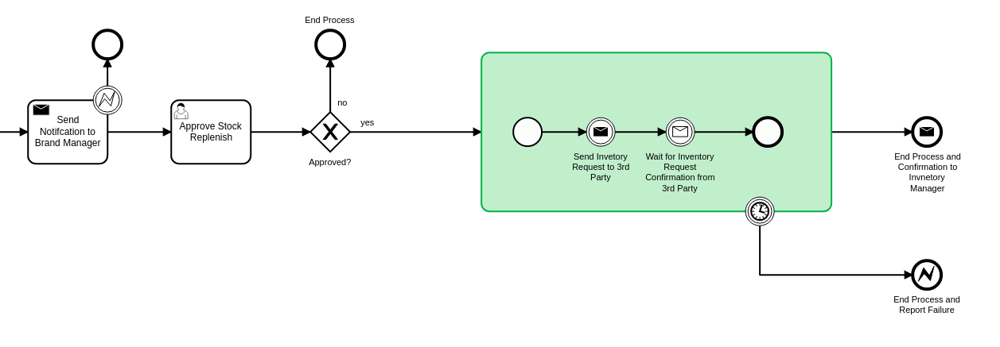
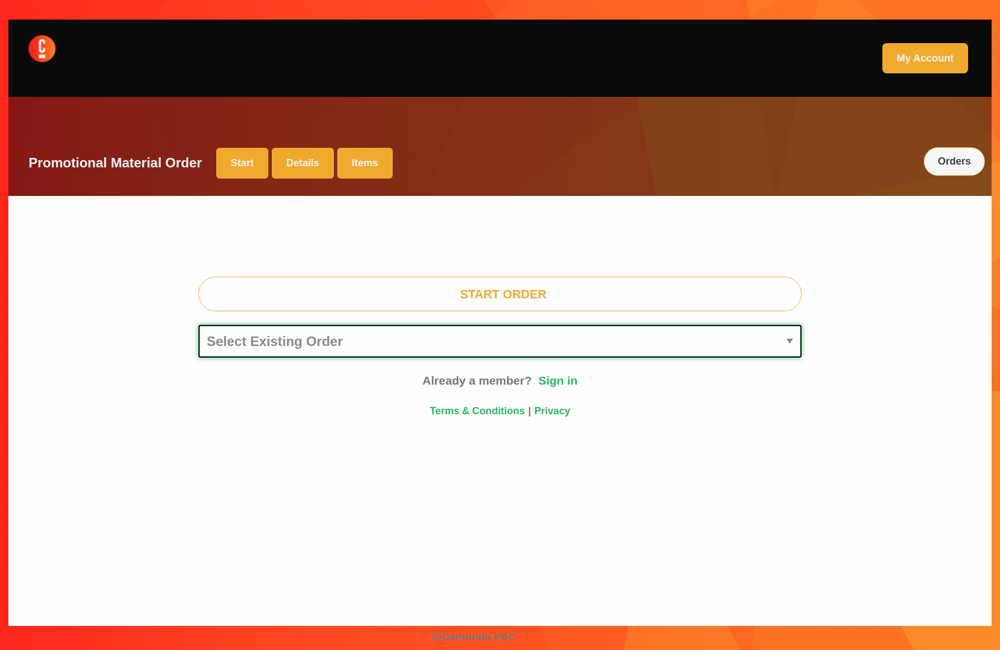

= Workflow Business Case: Ordering with Approvals and Complex Business Data
Doc Writer <paul.lungu@camunda.com>
v1.0, 2014-08-01
:toc: right

#### https://github.com/plungu/camunda-react-springboot-example[Go to Code]

See the https://github.com/plungu/camunda-react-springboot-example[code in github]. You can downlaod and run the project.

## Use-Case

Ordering use case is focused on demonstrating the ordering process through Web Based UI, Notifications and Camunda workflow. The ordering process models have several human review steps where a approval or rejection can happen and systems integration steps where communication with API's happens.

Below is a collaboration diagram illistrating how the different particpants interact with each other. Notice this is not a technical diagram and is soley for understanding. https://cawemo.com/[Camunda Cawemo] was used to model this BPMN diagram. The technical models that are deployed are in `./src/main/resources/processes`

image:./docs/images/use-case.png[Use Case]
====
The above process use case is initiated when product inventory becomes available. The *Inventory Notification Process* is activated by a scheduled job BPMN Timer event, which is fired off every day. The notification process checks the inventory levels and determines if there are eligible employees for the existing inventory.

The eligibility is determined by information queried from the entitlement system as well as a DMN Business Rule table. Once eligibility is established then an email is sent to the eligible employees with links to the Ordering application.

An order is started in the custom ordering UI. The order can be saved at any point in the order cache/db. When the order is complete it is sent for approval. The *Order Approval Process* is started and waits for a manager to approve the order. Once approved the the *_Local_* inventory is updated and notification of approval is sent to the employee.

The *Stock Replenishment Process* is also initiated by a BPMN start timer event, once a day. It checks the product inventory levels and notifies the inventory manager when inventory is low and reorders inventory upon approval the sends a request to the *Inventory Provider* to create more inventory. Which subsequently updates the *local* inventory. Which of course potentially starts the entire process over.

====

## Running the use-case
IMPORTANT: Running the app once with no profile is necessary to initalize the Camunda database.
```
mvn spring-boot:run
```

Then again with the profiles to initialize the use case
```
mvn spring-boot:run -Dspring.profiles.active=ordering,email,gui,cors
```

**Profiles** can be specified at the command line when the application starts. The notation is as follows.

`-Dspring.profiles.active=ordering,email,cors`

Or you can use the application.properties file to specify the profile.

```yaml
spring.profiles.active: ordering,email,gui,cors
```

IMPORTANT: Using Camunda Enterprise - it's necessary to request a https://camunda.com/download/enterprise/[Camunda Enterprise License].

====
Update the settings.xml file in the project home with the credentials that you get from Camunda. This will allow you to pull the enterprise artifacts from our nexus repository.
====
NOTE: You may need to configure a proxy to reach our repository. See the example in the settings.xml.

//### Loading Test Data
//TODO: Create REST end-point to parse csv and load service request data, start processes associating with a service id/business key


### Testing with Postman

Use the postman collections in the `postman` folder.

With post-man you can move through the processes simulating REST requests to the app.

- starting the processes
- completing user tasks
- correlating messages
- loading test data

### See it running
**Visit `http://<server>:<port>/sr` to access the React app.**


## Architecture


====
The diagram above illustrates the interactions and logical components of the app. Note the app is all packed together into one artifact for easier development and PoC ing. But each component could be easily it's own deployable artifact.

Note the *Custom UI* is not depicted. For all intents an purposes it is a completely seperate app and is not depended on the workflow. The interaction between the *Ordering UI* and the workflow is asynchronous. Since the *Notification* workflow simple directs the user to the *Order UI* which then allows a user to complete the order without interacting with the workflow.

Once an order is complete the Approval Workflow is started but is not dependent on the order UI in any way. The approval workflow interacts with users and the inventory API.

Purple lines signify point-to-point synchronous HTTP/REST interactions with the workflow and other components.

This application utilizes mostly synchronous blocking API calls to the JAVA and REST API's. Though as explained prevoiusly there are some subtle but important asynchronous and choreographed interactions.
====
### [[workflow-execution]]Access to the workflow execution context
====
The workflows in this project utilize the workflow execution to perform actions and interact with other systems and control the flow of custom code execution through the use of Java Delegate and Execution Listeners.

*Java Delegates* as shown below are marker interfaces that allow the executing class to be passed the execution context know as the DelegateExecution object. This object contains many functions that allow the Delegate to interact with the engine and data in the process. This is also a natural extension point that can be used to integrate with other systems. An example would be calling an email service to send email based on workflow variables.



*Execution Listeners* function in much the same way as a JavaDelegate and the interfaces can be used interchangeably. Conceptually the execution listener is intended to be placed in the process in a more subtle way. *Execution Listeners* are placed in the execution on events that are part of the workflow execution. See the docs to understand more about https://docs.camunda.org/manual/latest/user-guide/process-engine/delegation-code/#java-delegate[Delegation Code]

https://docs.camunda.org/manual/7.12/user-guide/process-engine/transactions-in-processes/#understand-asynchronous-continuations[Read more about placing listeners here]. Also, in the https://docs.camunda.org/manual/7.12/user-guide/process-engine/transactions-in-processes/[same doc] read about wait states and transaction bounderies to provide more contect on the operation of the engine.



====

### Patterns for Polyglot Programming
#### External Task Pattern

====
The red activity above illustrate the external task pattern configuration. The single task is configured as a topic. The control is inverted and a calling worker will application will ask for work from the engine through the external task API. The external task API is quite powerful allowing the caller to request work in bulk and complete tasks in bulk. Also it allows for creating incidents and errors in the engine.

Additionally, the worker application can be written in any technology as it is independet of the Camunda engine.

See the https://docs.camunda.org/manual/develop/user-guide/ext-client/[external task docs] for more about the API.

See the https://camunda.com/best-practices/invoking-services-from-the-process/#_understanding_and_using_strong_external_tasks_strong[Best Practices] for insights on external tasks.

====
#### Send and Recieve

====
The *Send and Receive* or bup/sub pattern is used in cases where simplicity in interaction with API's is preferred to the power and complexity of the external task api. It also provides some flexibility in the modeling approach as the send activity and receive activity do not need to be in sequence. Other activities can be used in parallel with the send and receive activities.

It's often required to use a small amount of Java code, <<workflow-execution,see Java Delegate section>>, with the *Send* task which provides flexibility in implementation and allows integration with other messaging systems. The publishing Send task code should likely be dumb and only do very specific publishing function.

The *Receive* task can be correlated through the REST API and any technology can be used to implement the subscribing application. The subscriber would likely live outside the engine application context.
====

### ReactJS UI Integration


The Maven frontend-maven-plugin configured in pom.xml is used to build the ReactJS app. The plugin creates a bundle.js file which ends up in `src/main/resources/static/built/bundle.js`. The static directory makes static resources such as JS and HTML available to the java app.

The Java application boot-straps the ReactJS App through Thymeleaf a java/spring frontend framework. The templates directory `src/main/resources/templates/app.html` has a HTML file app.html which calls the React app through a `<script />` tag loading the HTML into the react div `<div id="react"></div>`

Thymeleaf ties the Java frontend together using a Spring controller. `src/main/java/com/camunda/poc/starter/use-case/service.request/controller/ui/UIServicerequestController.java`. Mapping the app context to /sr and calling the app.html.

The React Components are organized under the `src\main\js\reactjs` folder into a use-case folder then subdivided by component.

Webpack and package.json define the structure and dependencies for the React App that allow and build the app into the bundle.js which is later placed in the static directory as explained previously. Allowing our frontend to load the plain EcmaScript.

Foundation CSS is used for styling https://get.foundation/sites/docs/index.html

### Handling Business Data and UI Integration
TIP: see the pattern described in the Camunda Best Practices https://camunda.com/best-practices/handling-data-in-processes/ and https://camunda.com/best-practices/enhancing-tasklists-with-business-data/

Often and for numerous reasons we need to consolidate data from different sources. In this app I use JPA and Spring REST with some of springs features to build a custom API. Primarily for making integration with the UI easier. Here are few reasons why I take this approach.

- Reduce queries the UI does to the backend
- Make it easier to build UI components
- Create abstraction layer that can be used to integrate other technical and business requirements like reporting and security.
- Have a source of truth for process meta-data

NOTE: Also keep in mind I want to keep every-thing self contained for PoC purposes. Think in logical terms and that these components could be another technology or several other technologies depending on the specific needs.


#### Camunda REST API
====
Camunda has a powerful rest API. This code repository has many examples of interacting with the CAMUNDA REST API from the custom UI and using postman. See the `postman` folder in the project home.

Import the post man collection and take a look at the queries to start the workflow and correlate messages.

see more https://docs.camunda.org/manual/latest/reference/rest/[CAMUNDA REST API]

====

#### JPA Spring Data Repositories
====
A separate API and logically separate data-store is used to query order data.

We can guarantee the data is updated in the data store with the workflow. See the section above on the JavaDelegates that implement the publishing functionality.

https://spring.io/blog/2011/02/10/getting-started-with-spring-data-jpa[Spring Data JPA] is the technology used for business data. Spring Data allows for an easy way to create API's that are easy for a UI to query. Also an easy way to combine data into a useful form for the UI to consume.
====

## Developing with this PoC Starter Project
#### Setting up React for Dev

- Configure the api endpoint. This is the backend spring-boot server where the react app gets data
```
In the .env file in the project home directory change the environment variables to match the spring-boot server context.

* Note you should only need to do this if you cannot access the spring-boot server on localhost and you plan to run the React App standalone.

* If running the react app as a standalalone and not on localhost configure the API_HOST and API_POST environment vars as follows inserting your host and port for the spring-boot server.

    API_HOST=http://127.0.0.1
    API_PORT=8080
    API_ROOT=api

* Note, you will need to use the cors profile in this setup and potentially modify the cors config in the spring-boot app.

```
- Run node and server.js by starting a node server in the home directory of the project. You may need to run `npm install` first.
```
nodemon server.js
```
also run the web-pack watch in the project home so you can update the bundle as you build reactjs
```
webpack -w
```

#### Mail Slurper

```
- to use mail slurper for dev
- cd into /dev-tools/mailslurper-1.14.1-linux
- execute ./mailslurper
```
Mail slurper is configured by editing the `/dev-tools/mailslurper-1.14.1-linux/config.json`
The app is configured to use mail slurper in the `application-mail.properties`

#### Running the server for Dev
NOTE: you need to run the cors profile when using nodemon

- Also note you can use spring-dev-tools to build front and back-end component in dev mode providing faster restarts and live-reload.

for dev mode run the following with the appropriate profiles
```
mvn spring-boot:run mvn spring-boot:run -Dspring.profiles.active=servicerequest,integration,cors
```

WARNING: spring-dev-tools affects the way Camunda serializes objects into process vars and will cause serialization errors in some cases. So it is commented out in pom.xml by default.
