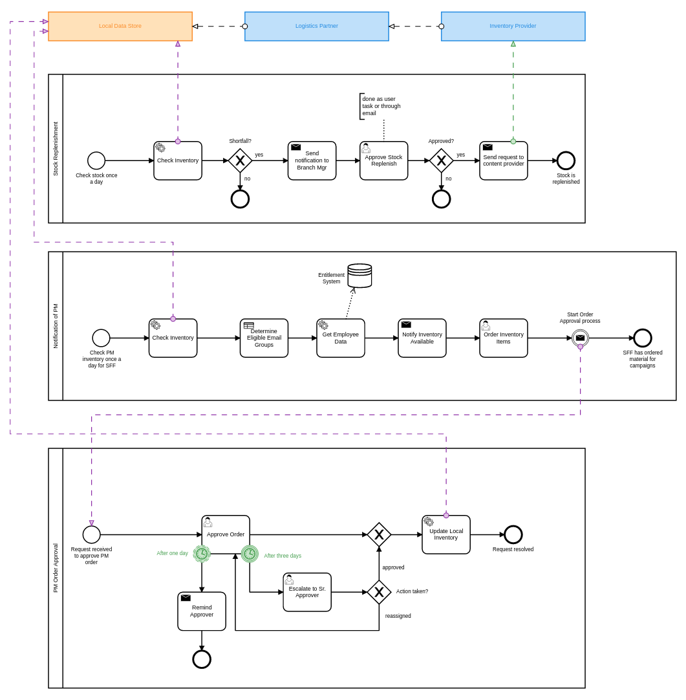

## Use-Case

Ordering use case is focused on demonstrating the ordering process through Web Based UI, Notifications and Camunda workflow. The ordering process models have several human review steps where a approval or rejection can happen and systems integration steps where communication with API's happens.

Below is a collaboration diagram illistrating how the different particpants interact with each other. Notice this is not a technical diagram and is soley for understanding. https://cawemo.com/[Camunda Cawemo] was used to model this BPMN diagram. The technical models that are deployed are in `./src/main/resources/processes`

====
The above process use case is initiated when product inventory becomes available. The *Inventory Notification Process* is activated by a scheduled job BPMN Timer event, which is fired off every day. The notification process checks the inventory levels and determines if there are eligible employees for the existing inventory.

The eligibility is determined by information queried from the entitlement system as well as a DMN Business Rule table. Once eligibility is established then an email is sent to the eligible employees with links to the Ordering application.

An order is started in the custom ordering UI. The order can be saved at any point in the order cache/db. When the order is complete it is sent for approval. The *Order Approval Process* is started and waits for a manager to approve the order. Once approved the the *_Local_* inventory is updated and notification of approval is sent to the employee.

The *Stock Replenishment Process* is also initiated by a BPMN start timer event, once a day. It checks the product inventory levels and notifies the inventory manager when inventory is low and reorders inventory upon approval the sends a request to the *Inventory Provider* to create more inventory. Which subsequently updates the *local* inventory. Which of course potentially starts the entire process over.

====
